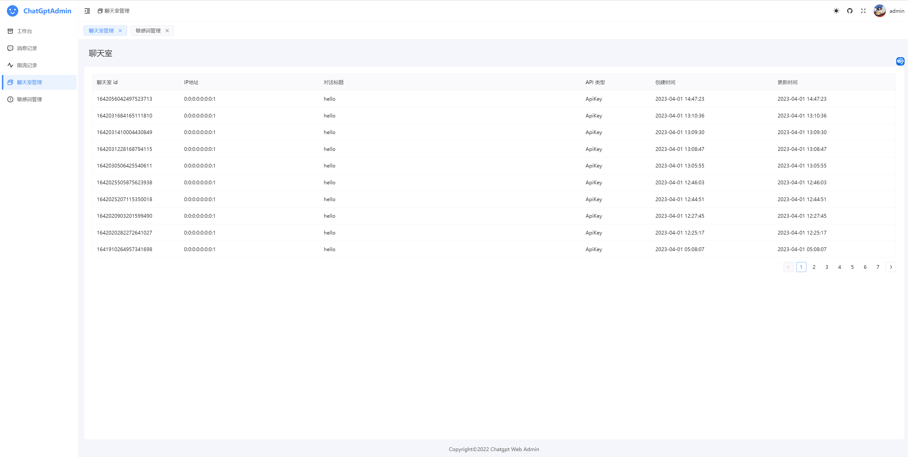

# 解字 chatgpt-jiezi

# 注意

### 关于提问

有问题优先通过文档和 issue 解决，也许你遇到的问题已经有解决方案了，没有的话可以提新的 issue。

### 关于 ApiKey

当前网站免费提问，因 ApiKey 额度有限，限流频率会比较高，如果有大佬赞助供网站使用的话十分感激。

# 介绍

- 本项目为解字管理端代码
- 前端开发[@mjjh](https://github.com/mjjh1717)
- 前端-说文用户端开源代码 https://github.com/mjjh1717/chatgpt-shuowen
- Java 后台 https://github.com/hncboy/chatgpt-web-java

## 地址

- 用户端：
  - https://front.stargpt.top/ (失效)
  - https://front1.stargpt.top/
  - https://front2.stargpt.top/
  - https://front3.stargpt.top/

## 功能

### 消息记录

展示消息的列表，问题和回答各是一条消息。通过父消息 id 关联上一条消息。父消息和当前消息一定是同一个聊天室的。


### 限流记录

查看各个 ip 的限流记录，只记录在限流时间范围的限流次数。


### 聊天室管理

查看聊天室。这里的聊天室和客户端左边的对话不是同一个概念。在同一个窗口中，我们既可以选择关联上下文发送后者不关联上下文发送。如果不关联上下文发送每次发送消息都会产生一个聊天室。



### 敏感词管理

查看敏感词列表，目前只提供了查询的功能，后期可以增加管理。


# 构建运行

### Getting Started

```shell
# Recommended setup git autocrlf 为 false
git config --global core.autocrlf false

# Clone Project
git clone https://github.com/hncboy/chatgpt-jiezi

cd chatgpt-jiezi

# Install dependencies(Recommended use pnpm: https://pnpm.io/zh/installation)
npm i -g pnpm # Installed and can be ignored
pnpm i # or npm i

# Start
pnpm dev
```

### Build and Release

```shell

# Prod Environment
pnpm build
```

### Other

```shell
# eslint check
pnpm lint

# eslint check and fix
pnpm lint:fix

# Preview（Need to build first）
pnpm preview

# Commit（add+husky+commitlint）
pnpm commit
```

# 修改配置

## 请求地址

从根目录 .env 文件中修改不同环境中的请求路径
开发环境从 .env.development 中修改 VITE_BASE_URL
构建环境从 .env.production 中修改 VITE_BASE_URL

## 修改配色

从根目录 /public/theme.json 文件中修改基础配色

## 修改图标

本项目图标使用 iconify 图标

首先去图标库地址：[icones](https://icones.js.org/) 找合适的图标

1. 结合 unocss 使用

```html
<i i-carbon-sun /> <i class="i-carbon-sun" />
```

2. 结合插件 unplugin-icons 自定义标签使用

`<icon-[iconify图标名称]`

```html
<icon-ant-design:fullscreen-exit-outlined /> <icon-ant-design:fullscreen-outlined />
```

这种方式还支持自定义 svg 图标，本项目自定义 svg 图标固定放在 src/assets/svg 下

`<icon-custom-[svg图标文件名]`

```
<icon-custom-logo />
```

具体配置参看 build/plugin/unplugin.js

3. 结合 Naive UI 的 NIcon 组件封装使用

```html
<!-- iconify图标 -->
<TheIcon icon="material-symbols:delete-outline" />
<!-- 自定义svg图标 -->
<TheIcon icon="logo" type="custom" />
```

封装组件参看 src/components/icon

参考 https://juejin.cn/post/7095460309673967646

## UnoCss

[UnoCSS 属性查询地址](https://uno.antfu.me/)

[保熟的 UnoCSS 使用指北，优雅使用 antfu 大佬的原子化 CSS](https://juejin.cn/post/7142466784971456548)

# 风险声明

本项目仅供学习和研究使用，不鼓励用于商业用途。对于因使用本项目而导致的任何损失，我们不承担任何责任。

# 感谢&赞助

- 非常感谢大家对我们项目和开发工作的支持和认可。我们深知在开源软件开发过程中，用户和社区的反馈和支持是至关重要的。我们的项目代码已经提供了 README 和 issue，方便用户进行部署和解决问题，同时也可以促进我们项目的活跃度，会优先关注 issue 的问题。
- 然而，对于一些用户可能存在需要二次开发或部署方面的困难，我们在开发任务繁忙的情况下，难以抽出时间回答所有用户的问题，但我们会尽最大努力去回答用户的问题。同时，我们也可以提供付费的解答服务，为用户提供更多的支持。
- 我们的开发工作也在持续进行中，我们会不断迭代优化我们的技术设计方案和业务功能，项目不仅仅会提供所需的业务功能，也可以通过项目来学习一些技术的使用。如果您认为我们的开源项目有价值能帮助到您，并愿意支持我们的开发工作，可以为项目点个小星星或者请作者[喝一杯可乐发电](https://afdian.net/a/stargpt) 。我们将非常感谢。

# 联系方式

<div style="display: flex; align-items: center; gap: 20px;">
  <div style="text-align: center">
    
    <p>微信群</p>
  </div>
</div>
<div style="display: flex; align-items: center; gap: 20px;">
  <div style="text-align: center">
    
    <p>631171246</p>
  </div>
</div>


# License

MIT © [hncboy](LICENSE)
